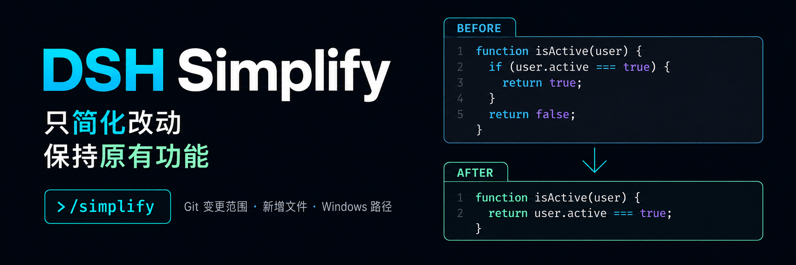

<p align="center">
  
</p>

<div align="center">

# DSH Simplify

**在 DeepSeek Harness 中简化最近改动的代码，保持原有功能。**

[English](README.md) · [安装](#安装) · [用法](#用法) · [故障排查](#故障排查) · [更新日志](CHANGELOG.zh-CN.md) · [Apache-2.0](LICENSE)

[](LICENSE)
[](https://github.com/deepseek-ai/deepseek-harness)
[](https://nodejs.org/)

</div>

DeepSeek Harness 代码简化插件。用 `/simplify` 整理刚改过的代码，让后续阅读和维护更轻松。

本项目为社区插件，并非 DeepSeek AI 官方产品。支持 DSH Web 及集成 DSH Web 的桌面应用。

命令文案及提示词使用简体中文。

兼容性：支持 DSH `0.1.0-rc.8`、`0.1.1-rc.2`、`0.1.2-rc.1`、`0.1.5-rc.1`，开发依赖保持 `0.1.5-rc.1`。四个版本均在 Windows 隔离环境通过类型检查、全部 41 项测试、打包安装及导入检查，并各通过一例真实模型 headless 验收：实际简化目标文件、行为测试通过、范围外文件保持不变。两个最早版本的完整宿主因 npm 解析停滞而显式补齐 peer；这些运行不代表普通完整宿主安装或 Web 界面验收。

## 功能概览

写完一轮代码后，用 `/simplify` 请当前 Agent 整理刚改过的部分，改善可读性并保持原有功能。

- **聚焦本次改动**：按 Git 变更范围整理代码，避免把需求扩大到无关文件。
- **覆盖新增文件**：新文件可以整份审查，也支持尚无首次提交的仓库。
- **选择适合的范围**：默认检查工作区改动，也可仅检查暂存区、指定提交或路径。
- **提交后也能回看**：默认模式在工作区没有改动时，可回看最近一次提交。
- **范围不可靠时停止**：遇到冲突、文件变化或读取失败时返回原因，便于修正后重试。

命令提交的是简化任务；是否完成修改和验证，应以 Agent 后续回复和实际差异为准。

## DSH 产品生态

想直接使用完整工作台，可下载 [DSH Codex Desktop](https://github.com/MichengAI/dsh-codex-desktop/releases)；已有 [DeepSeek Harness](https://github.com/deepseek-ai/deepseek-harness) 环境，可按需独立安装以下 8 个自研插件。桌面端已随附这些插件。

| 插件 | 你可以用它做什么 |
| --- | --- |
| [Codex UI](https://github.com/MichengAI/dsh-codex-ui) | 整理项目与会话、搜索任务、跳转对话轮次 |
| [IM Connect](https://github.com/MichengAI/dsh-im-connect) | 从微信、飞书、钉钉等消息平台下任务、收回复 |
| [Automation](https://github.com/MichengAI/dsh-automation) | 按计划执行任务，查看每次运行的结果 |
| [Skills Manager](https://github.com/MichengAI/dsh-skills-manager) | 统一查找、启停、创建和导入本机技能 |
| [Archive Manager](https://github.com/MichengAI/dsh-archive-manager) | 搜索、恢复或清理已归档会话 |
| [Agency Agents](https://github.com/MichengAI/dsh-agency-agents) | 按任务选择并召唤专业角色 |
| [BTW](https://github.com/MichengAI/dsh-btw) | 在当前上下文中临时旁问，不打断主任务 |
| [Simplify](https://github.com/MichengAI/dsh-simplify) | 用 /simplify 整理 Git 改动范围内的代码 |

## 安装

要求 Node.js >= 22.19、PATH 中可执行的 Git，以及提供 `commands`、`subprocess` 服务的 DSH `0.1.2-rc.1`。会话需要关联本地 Git 工作目录。Windows、Linux、macOS 均已通过自动化测试（含真实宿主服务集成）；桌面应用中的实际安装仅在 Windows 验证。

当前版本为 `0.1.2`，支持 npm、安装包和源码安装。以下示例使用 `web` profile，请按实际环境替换。安装前停用其他注册 `/simplify` 的插件。

### 让 Agent 帮你安装（推荐）

把下面这段话发给任意能够执行本机终端命令的 Agent。将 `web` 替换为实际使用的 profile；安装完成后，在 DSH 中使用本插件。

```text
请将 DSH 插件 @michengai/dsh-simplify 安装到本机 web profile，执行：dsh plugin --profile web add @michengai/dsh-simplify@0.1.2 --registry=https://registry.npmjs.org/。安装后执行 dsh --profile web --dump-config，确认配置包含 michengai-simplify，并告诉我如何重新加载 DSH 和开始使用。
```

### 从 npm 安装

```powershell
[Console]::OutputEncoding = [System.Text.Encoding]::UTF8
$OutputEncoding = [System.Text.Encoding]::UTF8

dsh plugin --profile web add @michengai/dsh-simplify@0.1.2 --registry=https://registry.npmjs.org/
```

### 从本地安装包安装

从 [GitHub Release](https://github.com/MichengAI/dsh-simplify/releases/tag/v0.1.2) 下载 tgz，或在源码目录运行 `npm pack` 生成安装包，然后在安装包所在目录执行：

```powershell
[Console]::OutputEncoding = [System.Text.Encoding]::UTF8
$OutputEncoding = [System.Text.Encoding]::UTF8

dsh plugin --profile web add .\michengai-dsh-simplify-0.1.2.tgz --ignore-scripts
```

### 重新加载与确认

请在当前任务结束后安装或更新，桌面应用可能自动重载。若未生效，使用桌面应用的重新加载功能，或重启 `dsh web`；仅刷新浏览器不够。

执行 `dsh --profile web --dump-config`，确认包含 `michengai-simplify`。分享完整配置前先检查其中是否包含敏感设置。然后在 Git 项目会话中输入 `/simplify`。

## 用法

| 输入 | 范围 |
| --- | --- |
| `/simplify` | HEAD 到当前工作区的净改动，包含未跟踪新增文件；确实没有改动时回看最近一次提交 |
| `/simplify --staged` | 仅暂存区；所选暂存文件另有未暂存改动时拒绝执行 |
| `/simplify --ref=main` | 指定提交到当前工作区的差异，包含未跟踪文件；不回退其他提交 |
| `/simplify --ref HEAD` | 显式 HEAD 范围，不启动上一提交回看 |
| `/simplify src/a.ts "src/中文 文件.ts"` | 仅指定文件的改动；未跟踪文件按整文件处理 |
| `/simplify src` | 展开目录中的变更文件 |
| `/simplify -- --special.ts` | 选项终止符后可使用以连字符开头的路径 |

- 路径相对当前会话目录，支持仓库内绝对路径；提示词统一使用仓库根目录相对路径。
- 支持单双引号组合带空格路径，反斜杠按路径字符保留；不执行 Shell 展开、通配符或命令替换。
- `--ref` 支持分支、标签和单个提交表达式，不支持 `a..b` / `a...b`；不能与 `--staged` 混用。
- 没有首次提交时，所选范围内的文件视为新增文件，允许整文件整理：默认包含暂存与未跟踪文件，`--staged` 仅包含暂存文件。可指定文件或目录缩小范围，文件数量和大小限制仍然生效。只有一个提交且工作区干净时直接返回无变更。
- 上一提交回看相对于 HEAD 第一父提交；merge commit 不做多父合并审查。

## 命令结果

| 返回结果 | 含义 |
| --- | --- |
| `已提交 N 个文件的简化审查` | 审查任务已入队，不代表 Agent 已完成编辑或测试。 |
| `没有可简化的当前代码行` | 没有可操作的当前行，不发起模型请求；结果可能附带跳过明细。 |
| 错误信息 | 无法可靠建立审查范围，不发起模型请求；修正所报问题后再试。 |

## 故障排查

**回车后输入框清空，但没有回答。** 空审查不会启动 Agent。已收到的用户反馈中，后端返回成功，但两份 CHANGELOG 被判定没有可简化的当前行而跳过；部分宿主界面未明显展示这类命令结果，反馈可见性仍待排查。后端成功不等于界面已经显示结果。

**当前目录不是 Git 仓库。** 在正确的 Git 项目会话中执行，或自行初始化项目仓库。插件不会自动初始化仓库、暂存或提交。

**暂存文件还有未暂存改动。** 先自行保存或处理这些改动，再运行 `--staged`；也可用默认 `/simplify` 审查当前工作区的净改动。插件不会自动重置或 stash。

**安装器提示 peer 依赖缺失。** 官方包可能由 DSH 宿主运行时提供。应核实实际模块解析版本和后端加载结果，不要直接向 profile 重复安装宿主包；版本仍需满足 `package.json`。

**超时、输出超限或快照过期。** 使用具体文件或目录缩小范围，并在并发编辑结束后重试。

## 执行边界

插件只执行 Git 只读查询和读取本地文件，不自动 `git add`、提交、重置或存储工作区。Git 参数通过 DSH `subprocess` 的 `argv` 传递，不依赖 PowerShell/Bash 引用规则。

仓库和索引依据会话工作目录及 Git worktree 元数据确定；子进程不继承 `GIT_DIR`、`GIT_WORK_TREE`、`GIT_INDEX_FILE` 等仓库局部环境或临时配置覆盖，保留普通用户与仓库配置。Git 返回的仓库必须包含当前会话工作目录。

Git 失败、信号终止、取消、超时、输出截断、未解决冲突和过期快照都会阻止提示词投递，不将它们当作无改动。补丁解析器按正文核对每块的新旧行数，拒绝残缺正文，并排除上下文行。显式路径不存在、被忽略或位于仓库外时返回错误。

删除文件、纯删除行、仅重命名、二进制文件、非普通文件及大于 5 MiB 的文件不进入可编辑范围，并说明跳过原因。子模块不纳入 diff 收集。已检测到的改动全部被跳过时，不会因此扩大到其他范围。最多收集 200 个变更文件，单次 Git 最多 30 秒，整个范围收集最多 60 秒（进程终止还有最多 1 秒宽限）；Git stdout 上限 8 MiB、stderr 64 KiB，提示词上限 128 KiB。

所有文件累计最多 4,096 个离散行范围，审查清单元数据（含跳过明细）最多 128 KiB；收集过程中超限即停止，不截取部分文件提交审查。连续修改行按一个范围计数。最终提示词仍独立检查 128 KiB 上限；超限时请指定文件或目录缩小范围。

`--staged` 先确认所选暂存文件与工作区一致，并在入队前再次核对暂存区、HEAD 和文件 SHA-256，避免把 index 行号直接用于不同的工作区内容。Agent 编辑前还需复核内容快照；内容变化时停止该文件的简化并重新运行命令。

**修改范围是提示词约束，不是文件写入权限隔离。** Agent 按宿主工具和用户授权执行修改及测试；本插件没有拦截其他工具的写入，也不能保证排队后文件不再变化。不要把“已提交审查”理解成“已完成简化”。

实现针对本地文件系统与本地 subprocess 同一工作区，未验证远程 subprocess 或远程文件系统组合。

## 卸载

```powershell
[Console]::OutputEncoding = [System.Text.Encoding]::UTF8
$OutputEncoding = [System.Text.Encoding]::UTF8

dsh plugin --profile web remove @michengai/dsh-simplify
```

若桌面应用未自动重载，手动重新加载 DSH。卸载不会撤销 Agent 已产生的代码修改。

## 开发与验证

### 从源码安装

```powershell
[Console]::OutputEncoding = [System.Text.Encoding]::UTF8
$OutputEncoding = [System.Text.Encoding]::UTF8

git clone https://github.com/MichengAI/dsh-simplify.git
Set-Location dsh-simplify
npm ci --ignore-scripts
npm run check
dsh plugin --profile web add . --ignore-scripts
```

入口为 `lib/index.js`，必须先构建再安装；profile 使用本地链接时需要保留源码目录。

```powershell
[Console]::OutputEncoding = [System.Text.Encoding]::UTF8
$OutputEncoding = [System.Text.Encoding]::UTF8
npm ci --ignore-scripts
npm run check
npm pack --dry-run
```

测试使用真实临时 Git 仓库，覆盖路径、未跟踪文件、回退、冲突、暂存区错位、快照过期及执行错误。测试夹具位于 `.test-tmp`，正常结束时自动清理。

`tests/host.test.mjs` 检测 `%USERPROFILE%\.dsh\profiles\node_modules` 的 DSH 运行时；也可通过 `DSH_RUNTIME_ROOT` 指定其 node_modules 路径。检测到时执行隔离的真实服务注册、Git 执行、消息投递与卸载测试；缺失时明确标为跳过。测试不调用模型，不修改已安装 profile。

GitHub Actions 在 Windows、Linux、macOS 上检查类型与测试，并通过 `DSH_RUNTIME_ROOT` 使用开发依赖中的宿主运行时。发布正式 GitHub Release 后，`publish.yml` 先完成三平台检查，再核对版本、双语发布说明及安装包内容，通过 npm Trusted Publishing 发布，并把同一 tgz 上传到 Release。npm 中的工作流文件名需配置为 `publish.yml`，并允许 `npm publish`；不需要发布令牌。

| 目录 | 职责 |
| --- | --- |
| `src/args.ts` | 命令参数解析 |
| `src/exec.ts` | DSH subprocess 与 Git 错误、取消、超时处理 |
| `src/git.ts` | Git 范围选择、NUL 解析、行号与快照复核 |
| `src/prompt.ts` | 编辑任务、范围与验证提示词 |
| `src/command.ts`、`src/index.ts` | 命令处理、投递及生命周期 |
| `tests` | 回归与宿主集成验证 |

## 许可

[Apache-2.0](LICENSE)，Copyright 2026 MichengAI。
